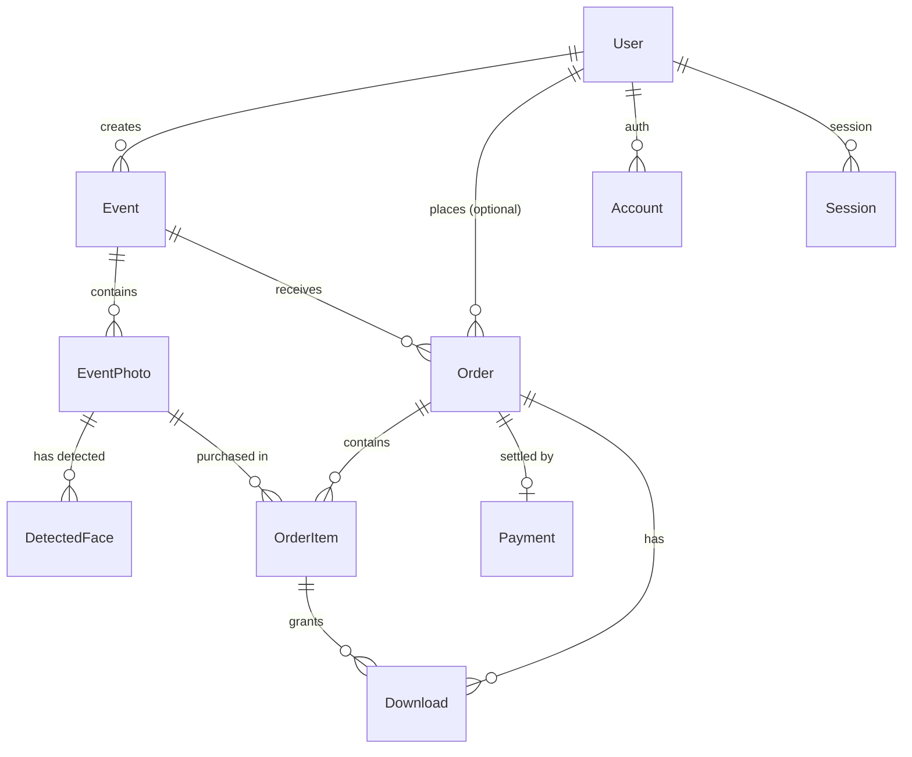

# Database Architecture & Prisma Schema Documentation

This document describes the relational database design, Prisma ORM configuration, entity relationships, and technical design decisions for the **Face Recognition Photo Marketplace** graduation project.

---

## 1. Overview

- **Database Engine**: PostgreSQL 16 (running via Docker container `photo_marketplace_db`).
- **ORM & Client**: Prisma ORM 5.x (`Frontend/prisma/schema.prisma`).
- **Client Instance**: Global singleton helper in [`Frontend/lib/prisma.ts`](file:///Users/nppn/Desktop/Project/Frontend/lib/prisma.ts).
- **Environment Configuration**: `DATABASE_URL` in `Frontend/.env`.

---

## 2. Entity-Relationship Diagram (ERD)



---

## 3. Models & Fields Breakdown

### 3.1 User & Authentication Models (`users`, `accounts`, `sessions`, `verification_tokens`)
Designed to seamlessly support **Auth.js** (NextAuth v5):
- **User**: Core entity storing user identity (`id`, `name`, `email`, `emailVerified`, `image`). Any registered user can act as an event host/creator or photo buyer.
- **Account**: OAuth provider link (Google, GitHub, Line, etc.).
- **Session**: Active session state token storage.
- **VerificationToken**: Email verification token storage.

### 3.2 Event Model (`events`)
Represents a photo-sharing event created by a user:
- `id`: CUID unique key.
- `creatorId`: Foreign key linking to `User.id` (`onDelete: Cascade`).
- `name`: Event title (e.g. "Bangkok City Marathon 2026").
- `slug`: URL-friendly unique identifier (`@unique`).
- `description`: Textual event details.
- `eventDate`: Scheduled date/time of the event.
- `coverImageKey`: Object key/path for the event banner photo.
- `pricingType`: `Pricing` enum (`FREE` or `PAID`).
- `pricePerPhoto`: Integer representing photo unit price in minor currency units (e.g. `4900` satangs = 49.00 THB).
- `currency`: ISO currency code (default: `"THB"`).
- `status`: `EventStatus` enum (`DRAFT`, `PROCESSING`, `PUBLISHED`, `ARCHIVED`).

### 3.3 EventPhoto Model (`event_photos`)
Stores images uploaded to an event:
- `id`: CUID primary key.
- `eventId`: FK to `Event.id` (`onDelete: Cascade`).
- `originalKey`: High-resolution storage key (protected/watermarked).
- `previewKey`: Watermarked preview key for web gallery.
- `thumbnailKey`: Thumbnail key for fast grid rendering.
- `width` / `height`: Image dimensions in pixels.
- `processingStatus`: `PhotoProcessingStatus` enum (`UPLOADING`, `PROCESSING`, `READY`, `FAILED`).

### 3.4 DetectedFace Model (`detected_faces`)
Represents individual face detections extracted from an `EventPhoto`:
- `id`: CUID primary key.
- `photoId`: FK to `EventPhoto.id` (`onDelete: Cascade`).
- `boundingBox`: JSON object storing normalized coordinates `{ "x": float, "y": float, "w": float, "h": float }`.
- `confidence`: Floating-point detection confidence score (0.0 to 1.0).
- `embedding`: Native PostgreSQL `Float[]` array representing the facial feature vector (e.g. 512 float values extracted via ArcFace/InsightFace).

### 3.5 Order & Financial Models (`orders`, `order_items`, `payments`, `downloads`)
- **Order**:
  - `id`: Order ID.
  - `eventId`: FK to `Event.id` (`onDelete: Cascade`).
  - `buyerId`: Optional FK to `User.id` (`onDelete: SetNull`). Nullable to enable guest checkout.
  - `status`: `OrderStatus` enum (`PENDING`, `COMPLETED`, `CANCELLED`, `FAILED`, `REFUNDED`).
  - `subtotal` & `total`: Amounts stored in integer minor currency units.
- **OrderItem**:
  - Links an `Order` to an `EventPhoto`.
  - `unitPrice`: Integer price at the time of purchase (`@@unique([orderId, photoId])`).
  - FK to `EventPhoto` uses `onDelete: Restrict` to prevent deletion of photos that have active financial order records.
- **Payment**:
  - `orderId`: Unique FK to `Order.id` (`1:1`).
  - `provider`: Payment gateway identifier (e.g., `"PROMPTPAY"`, `"STRIPE"`, `"OMISE"`).
  - `providerRef`: Payment intent or transaction reference ID.
  - `amount`: Settlement amount in integer minor currency units.
  - `status`: `PaymentStatus` enum (`PENDING`, `SUCCESSFUL`, `FAILED`, `REFUNDED`).
- **Download**:
  - Logs photo downloads by buyers (`orderItemId`, `orderId`, `downloadedAt`, `ipAddress`, `userAgent`, `metadata`).

---

## 4. Key Design Decisions

### 4.1 Flexible User Role Model
Instead of hardcoding rigid roles like `Photographer` vs `Customer` into separate models or tables, the system treats all accounts as unified `User` entities. Any registered user can create events, upload photos, or purchase photos from other events.

### 4.2 Monetary Representation (Minor Currency Units)
All currency amounts (`pricePerPhoto`, `subtotal`, `total`, `unitPrice`, `amount`) are stored as **integers representing minor currency units**:
- **Example**: 49 THB is stored as `4900` (satangs).
- **Rationale**:
  1. **Floating-point rounding errors**: Floating-point numbers (`Float`/`Double`) suffer from IEEE 754 precision loss during addition/multiplication (e.g., `0.1 + 0.2 = 0.30000000000000004`).
  2. **Payment Gateway Alignment**: Payment APIs (Stripe, Omise, PromptPay SDKs) require amounts in minor units (e.g., cents, satangs, yen).
  3. **Data Integrity**: Integer operations are exact, deterministic, and safe for database constraints and financial auditing.

### 4.3 Facial Embedding Storage & Connectivity
Each `DetectedFace` is connected to an `EventPhoto` via a 1:N relationship (`photoId`). A single photo containing 5 marathon runners will produce 5 distinct `DetectedFace` records linked to that `EventPhoto`.

- **Storage Format**: Native PostgreSQL float array (`Float[]` in Prisma schema).
- **Why `Float[]` for MVP?**:
  - Works natively in PostgreSQL without requiring third-party plugins or customized Docker images.
  - Fully visible and inspectable in Prisma Studio.
  - Simple cosine similarity calculations in Python FastAPI backend using NumPy / SciPy.
- **`pgvector` Tradeoff Analysis**:
  - `pgvector` introduces in-database vector indexing (`IVFFlat`/`HNSW`) and `<->` distance operator, enabling sub-millisecond similarity queries over millions of vectors.
  - However, `pgvector` requires custom PostgreSQL Docker images (e.g. `pgvector/pgvector`), raw SQL migrations in Prisma (`Unsupported("vector(512)")`), and additional operational complexity.
  - For the MVP, storing vector arrays natively (`Float[]`) keeps the database portable and setup zero-friction, while establishing a clean migration path to `pgvector` when scaling beyond 100,000+ faces.

---

## 5. Database Management Commands

| Task | Command (from `Frontend/`) |
| :--- | :--- |
| **Format Schema** | `npx prisma format` |
| **Validate Schema** | `npx prisma validate` |
| **Generate Client** | `npx prisma generate` |
| **Apply Migration** | `npx prisma migrate dev --name <migration_name>` |
| **Run Seed Script** | `npx prisma db seed` |
| **Inspect DB (Prisma Studio)** | `npx prisma studio` |

To launch **Prisma Studio** for interactive database browsing:
```bash
cd Frontend
npx prisma studio
```
This opens a web UI at `http://localhost:5555` to view, edit, and query PostgreSQL tables.
