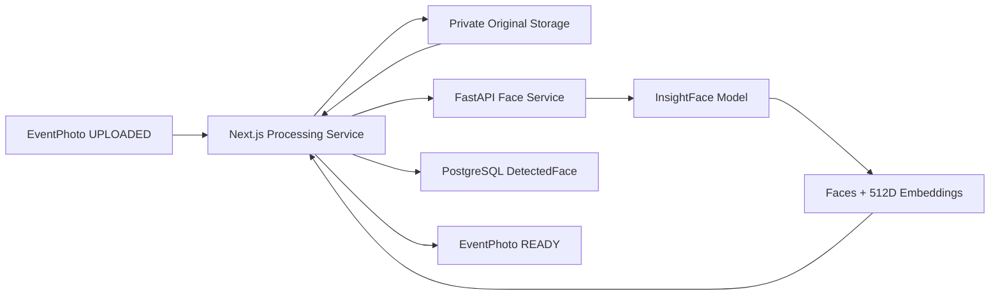
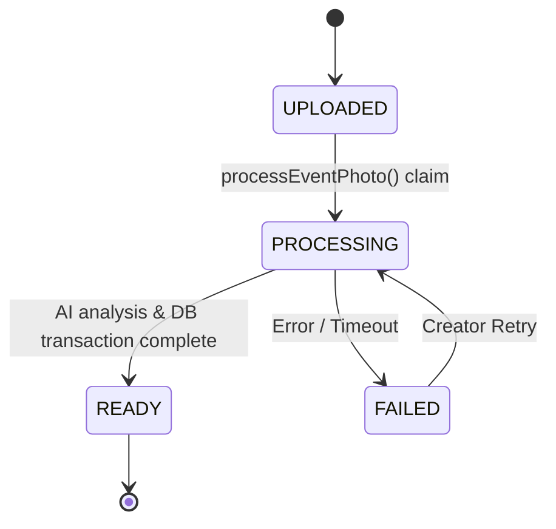

# Phase 8 — Event Photo Face Processing Pipeline Architecture

This document describes the server-to-server AI face processing pipeline implemented in Phase 8 of the Face Recognition Photo Marketplace.

## Overview

The processing pipeline connects uploaded private `EventPhoto` original files to the FastAPI Face Recognition service powered by InsightFace (`buffalo_l`). All image decoding, face detection, bounding box extraction, and 512-dimensional L2-normalized embedding generation happen strictly server-to-server (`Next.js` → `FastAPI`).



## Lifecycle States

`EventPhoto` records use `processingStatus` (`PhotoProcessingStatus` enum) to represent their current AI state:

1. **UPLOADED**: Original image, preview, and thumbnail variants have been generated and saved to private storage. The photo is queued or awaiting AI analysis.
2. **PROCESSING**: An atomic process claim has been placed on the photo. Next.js is reading the private original bytes from `StorageProvider` and invoking the FastAPI Face Service.
3. **READY**: AI processing completed successfully. All detected faces (including the valid 0-face case) have been stored in PostgreSQL as `DetectedFace` records.
4. **FAILED**: Processing encountered an error (e.g. storage missing, timeout, network error). A safe error code is recorded in `processingError` and creator retry is available.



## Database Models

### EventPhoto

```prisma
model EventPhoto {
  id               String                @id @default(cuid())
  eventId          String
  originalKey      String
  previewKey       String?
  thumbnailKey     String?
  width            Int?
  height           Int?
  processingStatus PhotoProcessingStatus @default(UPLOADING)
  processingError  String?
  createdAt        DateTime              @default(now())
  updatedAt        DateTime              @updatedAt

  event         Event          @relation(fields: [eventId], references: [id], onDelete: Cascade)
  detectedFaces DetectedFace[]
  orderItems    OrderItem[]

  @@index([eventId])
  @@index([processingStatus])
  @@map("event_photos")
}
```

### DetectedFace

```prisma
model DetectedFace {
  id          String   @id @default(cuid())
  photoId     String
  boundingBox Json     // Bounding box coords: { "x1": int, "y1": int, "x2": int, "y2": int }
  confidence  Float    // InsightFace detector confidence score
  embedding   Float[]  // Native PostgreSQL float array (512 L2-normalized float32 values)
  createdAt   DateTime @default(now())

  photo EventPhoto @relation(fields: [photoId], references: [id], onDelete: Cascade)

  @@index([photoId])
  @@map("detected_faces")
}
```

## Security & Biometric Privacy Directives

1. **Server-to-Server Only**: The browser communicates ONLY with Next.js route handlers. It never directly accesses `http://backend:8000/api/v1/faces/embed` or receives internal API keys.
2. **Private Original Input**: Next.js reads the private original image bytes using `StorageProvider.readObject(photo.originalKey)` and streams it directly to FastAPI. The browser never receives raw original bytes as part of AI processing.
3. **Internal Biometric Storage**: Face embedding vectors are stored inside PostgreSQL `detected_faces` table (`Float[]`) for future Phase 9 matching.
4. **No Embeddings in Public JSON**: Public photo list APIs and browser JSON payloads return only `_count.detectedFaces` and `processingStatus`. Embedding arrays are never returned in public JSON responses.
5. **No Face Crop Images**: No persistent face crop image files are created on disk. Only bounding box metadata and embedding vectors are saved.
6. **Cascade Cleanup**: Deleting an `EventPhoto` or an `Event` automatically cascades through Prisma to delete all associated `DetectedFace` records.

## API Endpoints

- `POST /api/events/[id]/photos/[photoId]/process`: Protected Route Handler to process or retry a single photo.
- `POST /api/events/[id]/photos/process-all`: Protected Route Handler to batch-process all `UPLOADED` or `FAILED` photos in an event with bounded concurrency.
