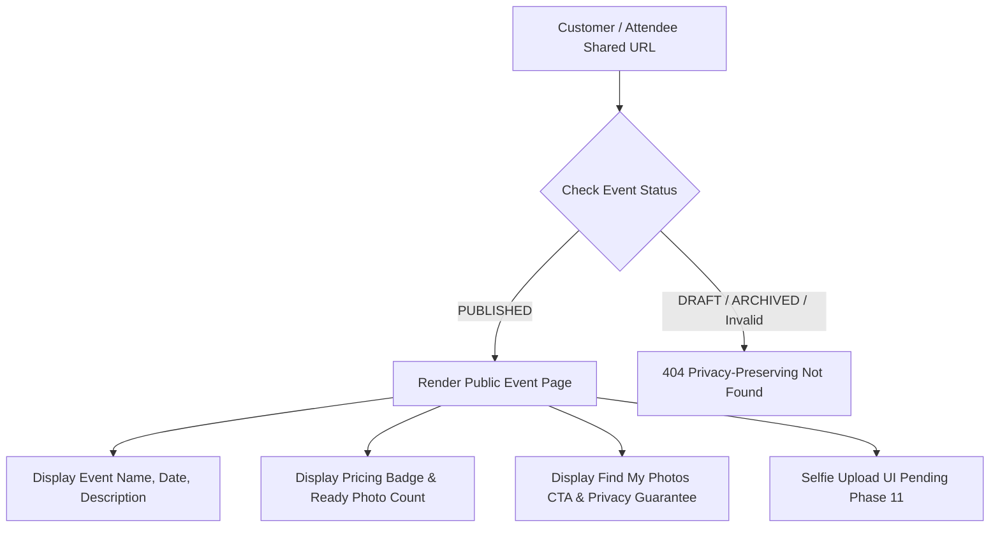

# Public Event Page Architecture (Phase 10)

## Overview & Privacy Boundary

Phase 10 introduces the **Public Event Page** (`/event/[slug]`), allowing creators to share a clean, responsive, customer-facing storefront for attendees.

### Core Security & Privacy Guarantees

1. **PUBLISHED-Only Access Control**: The public page renders ONLY for events where `status === 'PUBLISHED'`. `DRAFT` or `ARCHIVED` events return a privacy-preserving `404 Not Found` before loading event metadata.
2. **Logged-Out Public Accessibility**: Customers do not need Creator accounts or authentication to view published event pages.
3. **No Unauthenticated Gallery Leakage**: The page does NOT expose a public gallery grid of all event photos, preserving photography privacy until Phase 11 face search.
4. **Strict Payload Isolation**: Response metadata includes ONLY public fields (`name`, `slug`, `description`, `eventDate`, `pricingType`, `pricePerPhoto`, `currency`, `readyPhotoCount`). Unsafe fields such as `creator.email`, `creatorId`, `originalKey`, `previewKey`, `thumbnailKey`, `DetectedFace` records, and embeddings are NEVER loaded or transmitted to the client.
5. **Biometric Privacy Reassurance**: Includes a clear customer-facing privacy note: *"Your selfie is processed strictly in memory to search this event only and is never stored on our servers or shared with third parties."*

---

## Route & Layout Structure

* **Primary Public Route**: `/event/[slug]` (e.g. `/event/graduation-2026-a487ee`)
* **Loading Skeleton**: `Frontend/app/event/[slug]/loading.tsx`
* **Not Found Page**: `Frontend/app/event/[slug]/not-found.tsx`

---

## Key Page Features

1. **Hero Header**: Displays event name, published status badge, pricing badge (`FREE` or `฿49 / photo`), and creator display name (if present).
2. **Metadata Grid**:
   - Localized event date (e.g., `"Oct 24, 2026"`).
   - Searchable photos count: counts ONLY photos with `processingStatus === 'READY'`.
3. **Event Description**: Safely rendered text description with whitespace preservation.
4. **Find My Photos CTA Card**:
   - Hero banner highlighting AI-powered face search.
   - Action Button: "Find My Photos" (with honest Phase 10 status indicator: *"Selfie upload UI coming next (Phase 11)"*).
   - Handles zero-photo states gracefully ("Photos preparing").
5. **SEO & Metadata**: Dynamic OpenGraph title (`{Event Name} | SnapMarket AI`) with `robots: { index: false, follow: false }` to prevent automated search engine indexing of private photo event pages.
