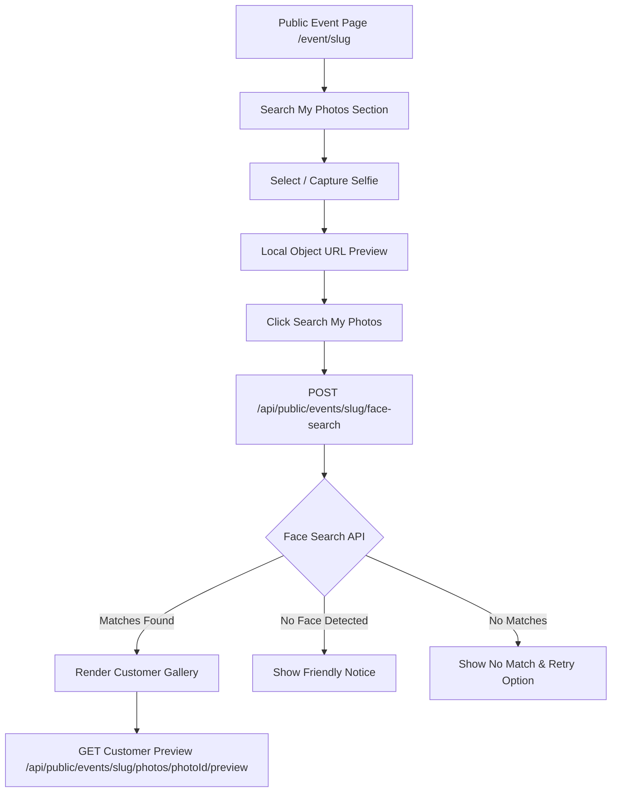

# Search My Photos UI Architecture (Phase 11)

## Overview & Flow

Phase 11 introduces the **Search My Photos UI** integrated directly into the Public Event Page (`/event/[slug]`). Customers can upload a selfie or capture one using a mobile camera to search an event for photos of themselves.

---

## Core Security & Privacy Guarantees

1. **Ephemeral Local Selfie Preview**: Selfies are previewed in the browser using `URL.createObjectURL(file)`. No selfie image is persisted in `localStorage`, `sessionStorage`, or `IndexedDB`, nor uploaded to storage prior to search submission.
2. **Proxied Face Search**: The browser POSTs `multipart/form-data` to Next.js (`/api/public/events/[slug]/face-search`), which forwards bytes server-to-server to FastAPI. The browser NEVER communicates directly with FastAPI or accesses `FACE_SERVICE_API_KEY`.
3. **Biometric Data Privacy**: Search responses return ONLY safe `photoId` list and `rank` order. No embeddings, bounding boxes, face counts per photo, or detector confidence levels are exposed to the client.
4. **Customer-Safe Photo Delivery**: Matched photos are retrieved via `GET /api/public/events/[slug]/photos/[photoId]/preview` or `thumbnail`.
   - Access is restricted to `PUBLISHED` events and `READY` photos.
   - Original images (`original` variant) are strictly BLOCKED and return `404 Not Found`.
   - Cross-event photo access (Event A slug requesting Photo ID from Event B) returns `404 Not Found`.
   - Response headers include `Cache-Control: private, max-age=3600`.
5. **No Persistent Search Records**: Biometric search operations do not write search history or identity profiles to the database.

---

## Component Architecture

* **`Frontend/components/public/search-my-photos-section.tsx`**: Client component managing selfie state, drag & drop, mobile camera capture (`capture="user"`), local preview, abort controller, error mapping, and form submission.
* **`Frontend/components/public/search-results-gallery.tsx`**: Client component rendering ranked result cards, price display badges, and "Try Another Selfie" actions.
* **`Frontend/app/api/public/events/[slug]/photos/[photoId]/[variant]/route.ts`**: Customer-safe preview delivery route.

---

## Error Code Mappings

| Error Code | Customer-Friendly Message |
| :--- | :--- |
| `NO_FACE_DETECTED` | We couldn't detect a face in this photo. Please upload a clear frontal selfie. |
| `INVALID_IMAGE` / `UNSUPPORTED_FORMAT` | Please select a valid JPEG, PNG, or WebP image. |
| `IMAGE_TOO_LARGE` | Image file size is too large. Please select a photo under 10 MB. |
| `FACE_SERVICE_UNAVAILABLE` / `SEARCH_UNAVAILABLE` | Photo search service is temporarily unavailable. Please try again shortly. |
| `FACE_SERVICE_TIMEOUT` | Search timed out. Please try uploading your selfie again. |
